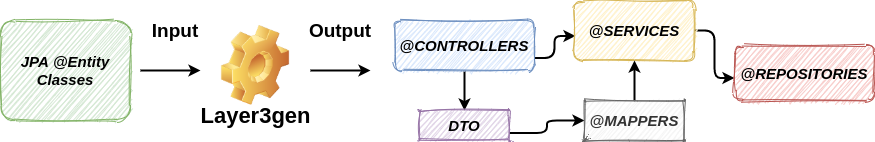

# Layer3gen
Generates the standard SPRING 3 layer CRUD architecture starting from JPA entities.
* * *

* * *
## How to run as a standalone application:
##### 1- Download and extract the ZIP file from the folder _/distribution_ ;
##### 2- Edit the file in /bin directory named _3layer-settings.yml_;
##### 3- Run the application ( layer3gen.sh or layer3gen.bat).

## How to run as gradle plugin:
##### 1- Add the plugin in your build.gradle;
```groovy
buildscript {
	dependencies {
		classpath "gradle.plugin.gae.piaz:layer3gen:1.6"
	}

	// ....
}

  // ...

apply plugin: 'gae.piaz.layer3gen'
```
##### 2- Create a file named _3layer-settings.yml_ in the directory src/main/resources/;
##### 3- Run the gradle task
```shell script
gradlew layer3gen
```

## 3layer-settings.yml configuration template:
```yml
projectPath: /home/tano/workspace_autogenerate/springboot-3layer-generator/demo
classesDirectory: build/classes/java/main
outputDirectory : src/main/java
options:
  dtoLayer : true

inputPackages:
  jpaEntities : com.example.demo.model

outputPackages:
  repositories : com.example.demo.repository
  services: com.example.demo.service
  controllers: com.example.demo.controller
```

## Examples: 
Checkout the example project with generated classes present in **/demo** folder.

### Repository generated example class:
```java
@Repository
public interface BooksRepository extends JpaRepository<Books, java.lang.Integer> {

}
```
### Service generated example class:
```java
@Service
public class BooksService implements CrudService<Books,java.lang.Integer> {

    @Autowired
    private BooksRepository repository;

    @Override
    public Books create(Books entity) {
        return repository.save(entity);
    }

    @Override
    public Books update(Books entity) {
        return repository.save(entity);
    }

    @Override
    public Page<Books> read(Books entity, Pageable pageable) {
        Example<Books> example = Example.of(entity);
        return repository.findAll(example,pageable);
    }

    @Override
    public Books readOne(java.lang.Integer primaryKey) {
        return repository.getOne(primaryKey);
    }

    @Override
    public void delete(java.lang.Integer primaryKey) {
        repository.deleteById(primaryKey);
    }
}
```
### Controller generated example class:
```java
@RestController
@RequestMapping("/books-dto/")
public class BooksControllerDTO implements CrudController<BooksDTO,java.lang.Integer>{

    @Autowired
    private BooksService service;

    @Autowired
    private BooksMapper mapper;

    @Override
    public ResponseEntity<BooksDTO> create(@RequestBody BooksDTO dto) {
       Books entity = mapper.toEntity(dto);
       entity = service.create(entity);
       return ResponseEntity.ok(mapper.toDto(entity));
    }

    @Override
    public ResponseEntity<BooksDTO> update(@RequestBody BooksDTO dto) {
      Books entity = mapper.toEntity(dto);
       entity = service.update(entity);
       return ResponseEntity.ok(mapper.toDto(entity));
    }

    @Override
    public ResponseEntity<Page<BooksDTO>> read(
            @RequestBody BooksDTO dto,
            @RequestParam("page") Integer page,
            @RequestParam("size") Integer size) {
        Pageable pageable = PageRequest.of(page,size);
        Books entity = mapper.toEntity(dto);
        Page<BooksDTO> pages = service.read(entity, pageable).map(mapper::toDto);
        return ResponseEntity.ok(pages);
    }

    @Override
    public ResponseEntity<BooksDTO> readOne(@PathVariable("id") java.lang.Integer primaryKey) {
         Books entity = service.readOne(primaryKey);
         return ResponseEntity.ok(mapper.toDto(entity));
    }

    @Override
    public void delete(java.lang.Integer primaryKey) {
        service.delete(primaryKey);
    }
}
```


